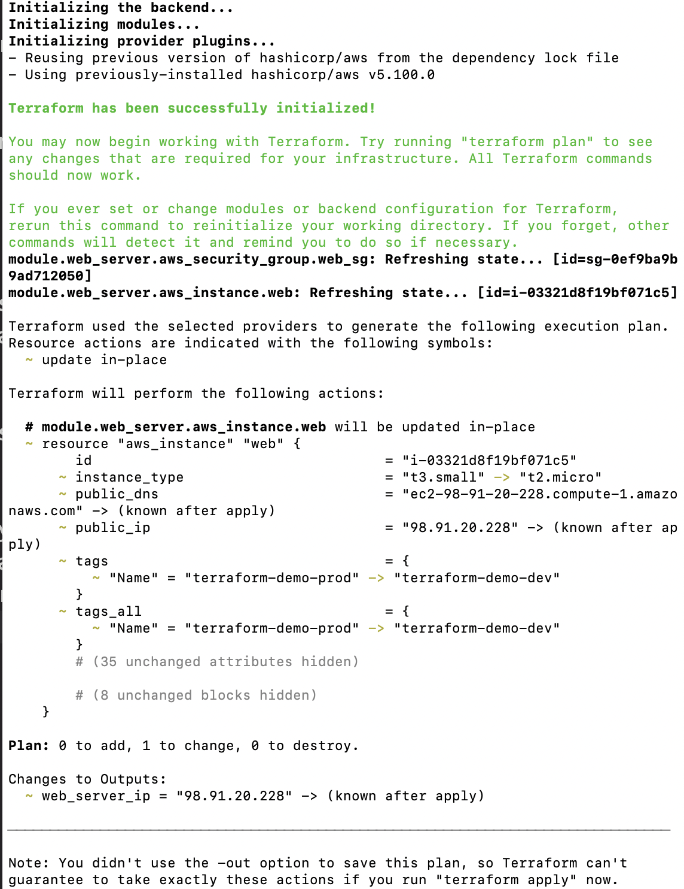
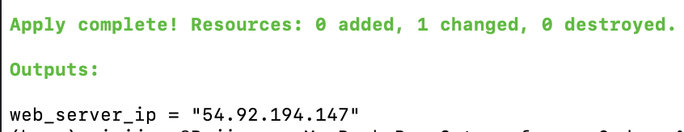
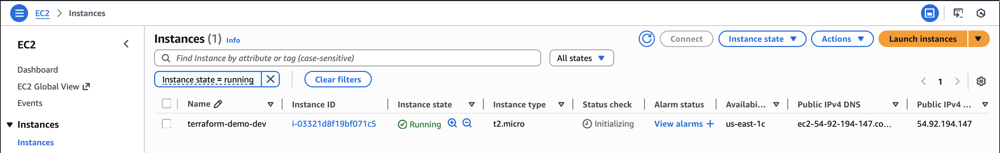
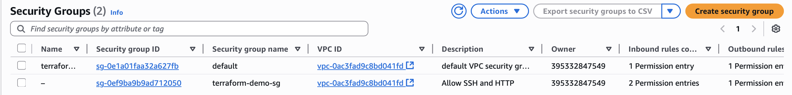

# Terraform EC2 Deployment Demo

This project shows how I used Terraform to automatically deploy a web server (EC2 instance) on AWS.  
I built this to learn Infrastructure as Code and practice real cloud automation steps.

---

## Project Info

- Deploys an EC2 instance using Terraform
- Creates a Security Group allowing SSH (22) and HTTP (80)
- Uses a custom Terraform module (`modules/web_server`)
- Supports multiple environments (dev / prod) using `.tfvars`
- Outputs the public IP after deployment
- Tested on AWS with AWS CLI + IAM user credentials

---

### Project Structure

```text
terraform-ec2-demo/
├── main.tf
├── variables.tf
├── outputs.tf
├── dev.tfvars
├── prod.tfvars
├── modules/
│   └── web_server/
│       ├── main.tf
│       ├── variables.tf
│       └── outputs.tf
└── .gitignore
```

### Screenshots

1. Project Folder Structure


2. Terraform Init + Plan


3. Terraform Apply Output


4. EC2 Instance Created by Terraform


5. Security Group Created by Terraform

